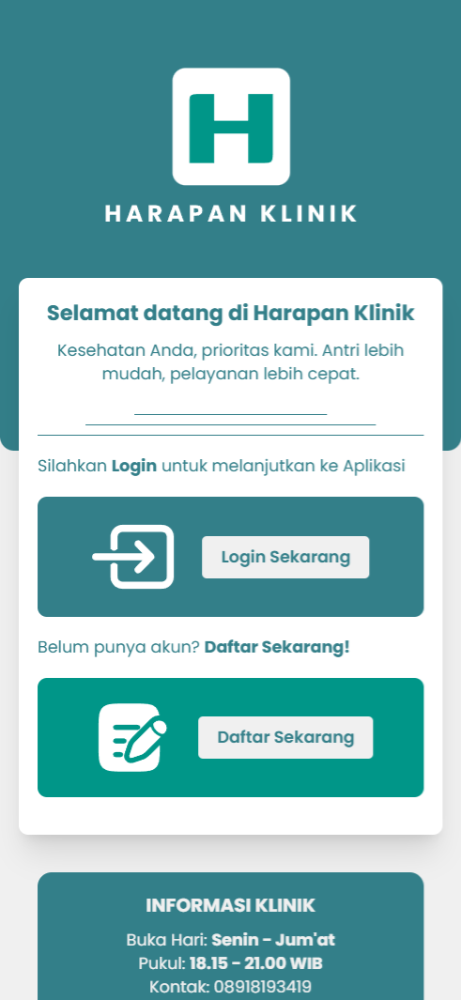
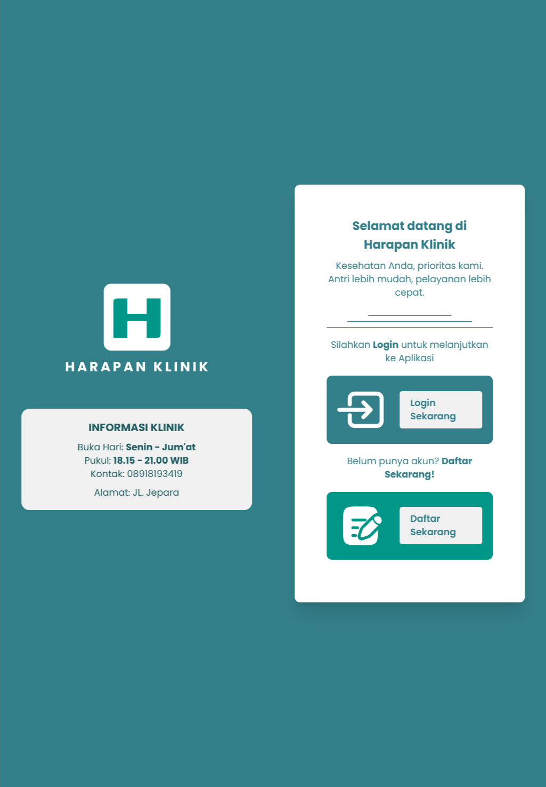
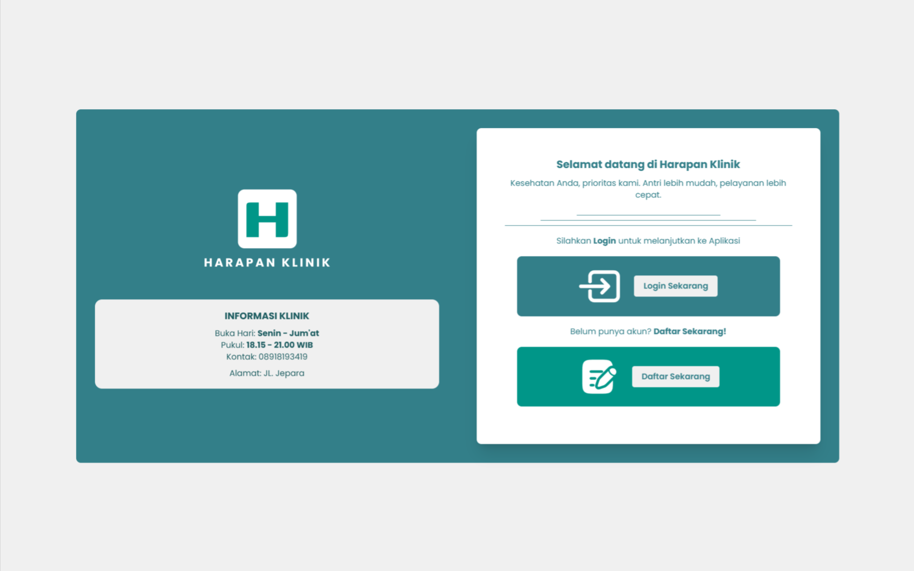
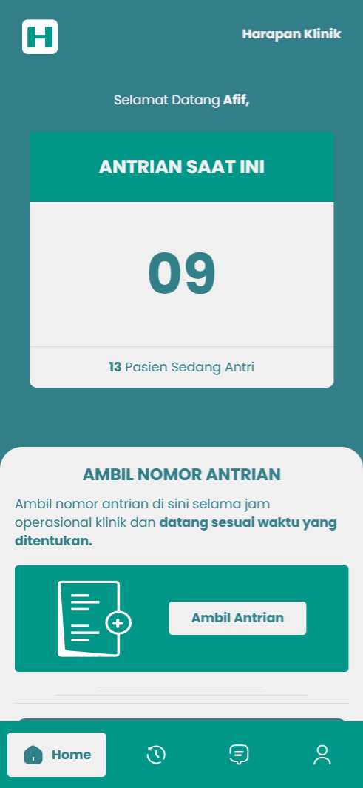
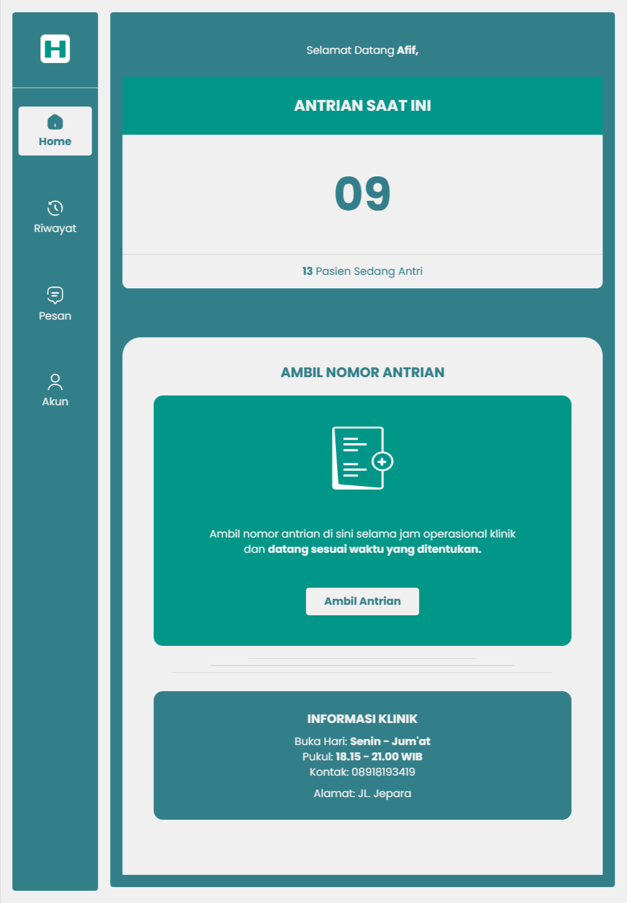
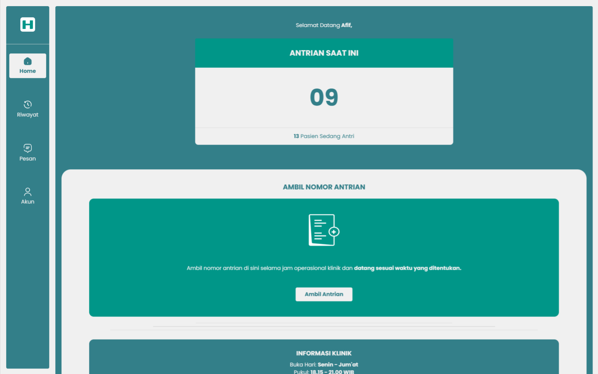

# Harapan Klinik

Harapan Klinik is a modern web application that simplifies the patient queue system by enabling users to book their clinic appointments online. Say goodbye to long lines and wasted time—Harapan Klinik is here to make your healthcare experience smoother and more efficient!

## Features

- 🔗 **Online Queue Booking**: Easily reserve your spot in the clinic’s queue without leaving your home.
- 🌈 **Beautiful UI**: A clean, responsive, and user-friendly interface powered by **Vite**, **Vue.js**, and **Tailwind CSS**.
- 🔧 **Frontend Only**: This project focuses on the frontend, making it ideal for learning and customization.
- 🔧 **Responsive Design**: Fully optimized for both desktop and mobile devices, providing a seamless experience across all screen sizes.

## Tech Stack

- **Framework**: [Vue.js](https://vuejs.org/) (Fast and scalable frontend framework)
- **Build Tool**: [Vite](https://vitejs.dev/) (Lightning-fast development environment)
- **Styling**: [Tailwind CSS](https://tailwindcss.com/) (Utility-first CSS framework)

## Getting Started

Follow these steps to set up and run the project locally:

### Prerequisites

Make sure you have the following installed:

- [Node.js](https://nodejs.org/) (version 16 or later)
- [npm](https://www.npmjs.com/) or [yarn](https://yarnpkg.com/)

### Installation

1. Clone the repository:

   ```bash
   git clone https://github.com/your-username/harapan-klinik.git
   ```

2. Navigate to the project directory:

   ```bash
   cd harapan-klinik
   ```

3. Install dependencies:
   ```bash
   npm install
   # or
   yarn install
   ```

### Running the Development Server

Start the development server:

```bash
npm run dev
# or
yarn dev
```

Open your browser and navigate to `http://localhost:5173` to view the application.

### Building for Production

To create a production-ready build:

```bash
npm run build
# or
yarn build
```

The output will be located in the `dist` directory.

## Screenshots

### Welcome Page

- **Mobile View**
  

- **Tablet View**
  

- **Desktop View**
  

### Home Page

- **Mobile View**
  

- **Tablet View**
  

- **Desktop View**
  

## Demo

Experience the live demo here: [Harapan Klinik Demo](https://afirenth.github.io/harapan-klinik/)

## Contribution

This project is a learning initiative and is open to contributions. Feel free to fork the repository, make improvements, and submit a pull request. Your input is highly appreciated!

---

Thank you for checking out **Harapan Klinik**! Together, let’s build a better way to manage clinic queues. 🙏
